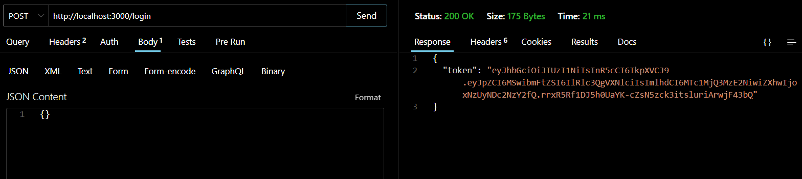
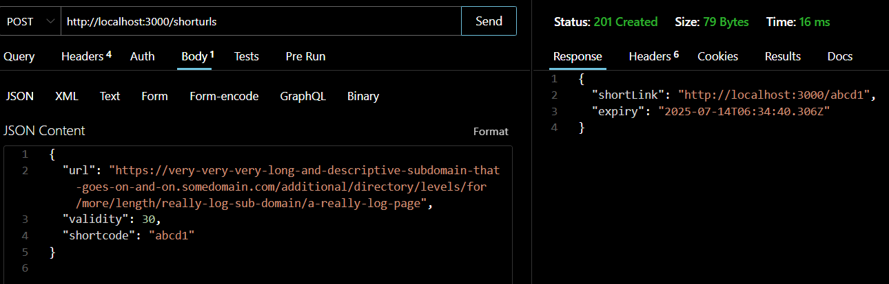
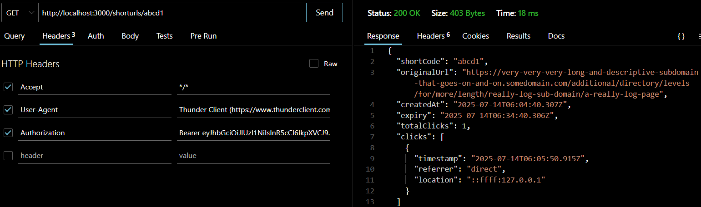

# 12211051
# 📌 HTTP URL Shortener Microservice

This project is a microservice built using **Node.js** and **Express.js** that allows users to shorten long URLs, manage validity periods, track usage statistics, and optionally set custom shortcodes.

---

## 📸 Reults

   

   

   
